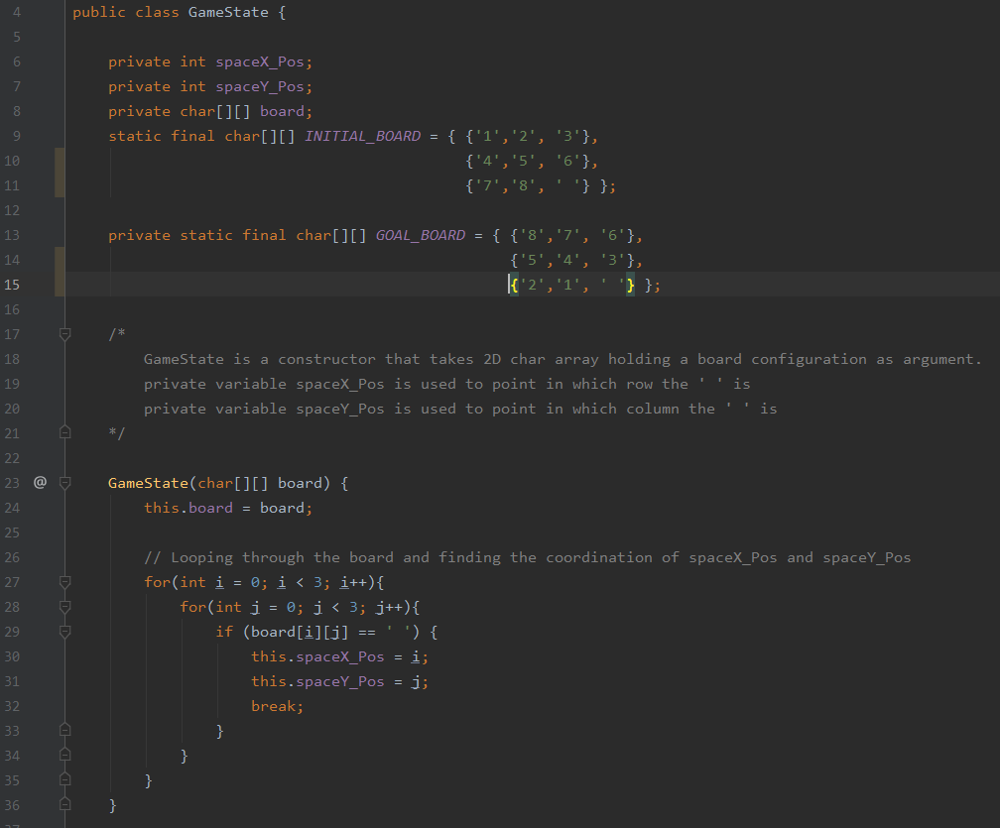
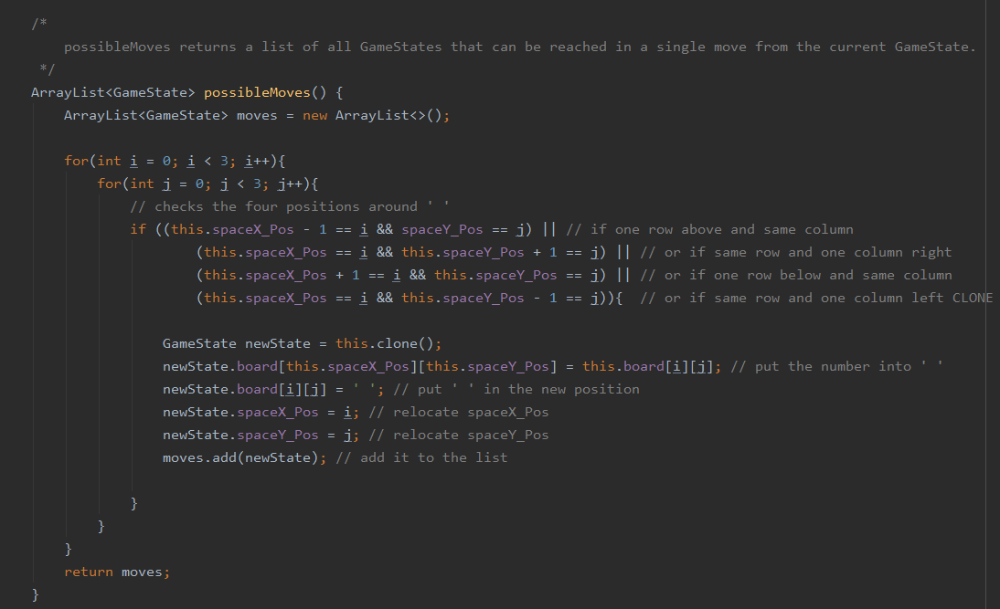
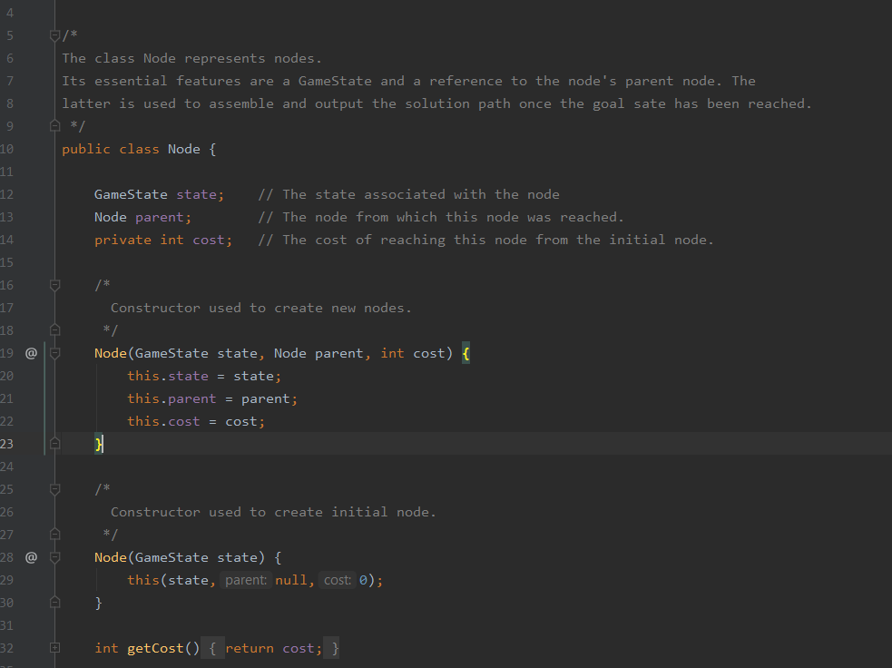
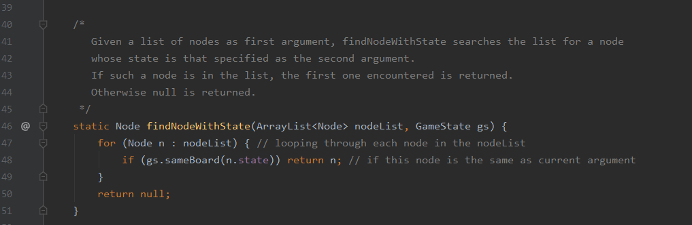
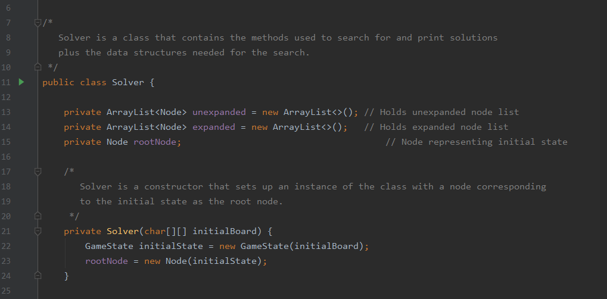
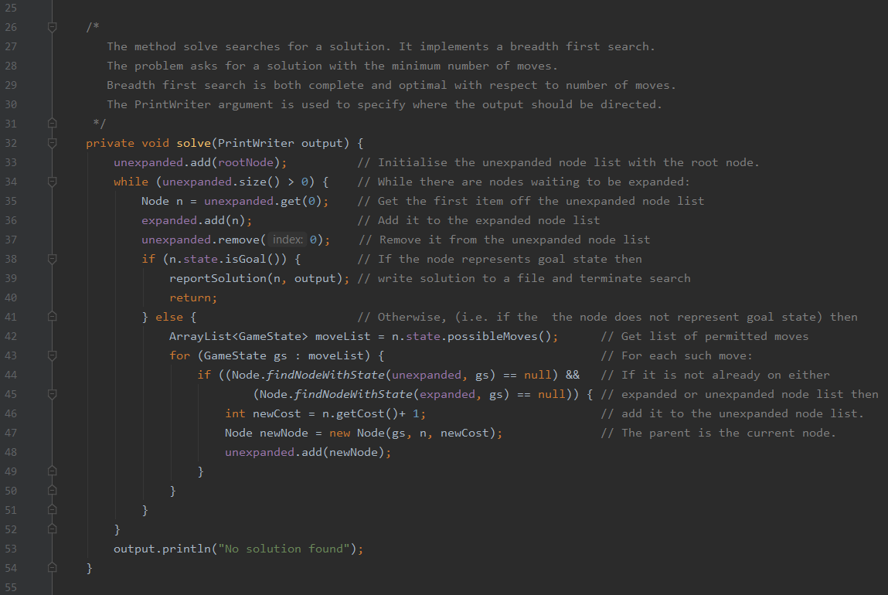
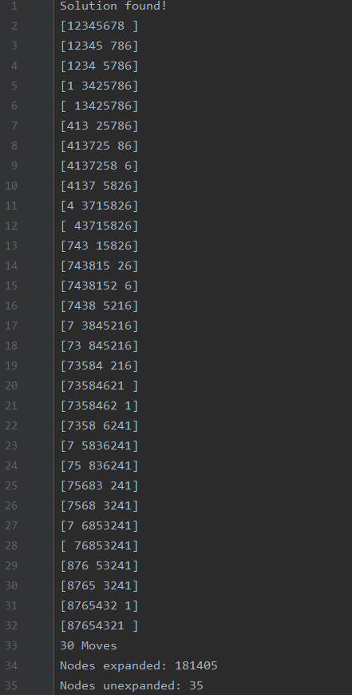

# Everything is explained within the comments of the program
GameState class constructor.

Only the adjacent numbers to the empty space can switch places with it.

Node constructors.

FindNode method searches weather the node has already been encountered.

Solver constructor.

Implementing the BFS.

The output of the program for that current initial state and goal state.

